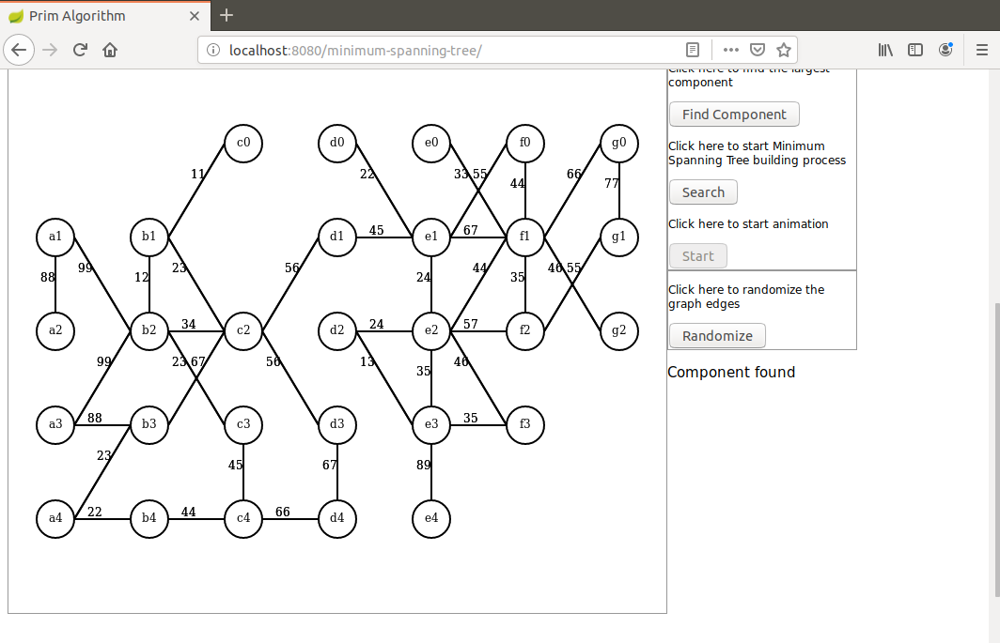
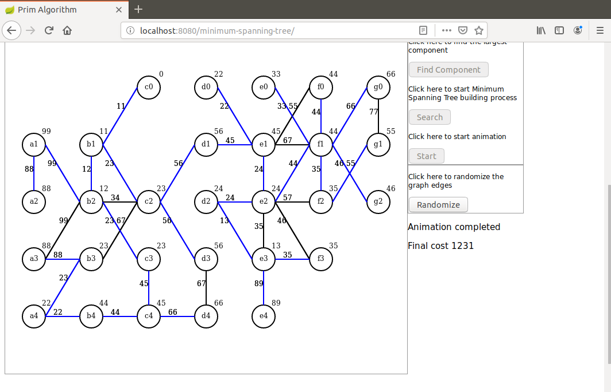

# prim-anim

I present here a Java based demonstration of the Minimum Spanning Tree using Prim algorithm.

Only a recent Maven version is required to run this application (I used 3.6.0).

The algorithm itself is implemented in Java, Javascript is only used for initialization and display on Canvas.

First an undirected graph is randomly created and its largest connected component is extracted (Java side).

Then a minimum spanning tree is built (Java side) with all intermediate results saved as a collection.

This collection is then sent to the browser as a JSON object.

The collection is used for an animated display (browser side).

To launch the demo run the command in project directory: `mvn spring-boot:run`.

When the application has started hit the browser on URL `http://localhost:8080/minimum-spanning-tree`.

Here are some screen shots that can be seen in this demo.

After graph initialization:

After the component was found:

After the end of the animation:

For a step-by-step demonstration please visit this repository:

https://github.com/dubersfeld/prim-step

For a demonstration of Kruskal algorithm please visit the following repositories:

https://github.com/dubersfeld/kruskal-step

https://github.com/dubersfeld/kruskal-anim

Dominique Ubersfeld, Cachan, France
